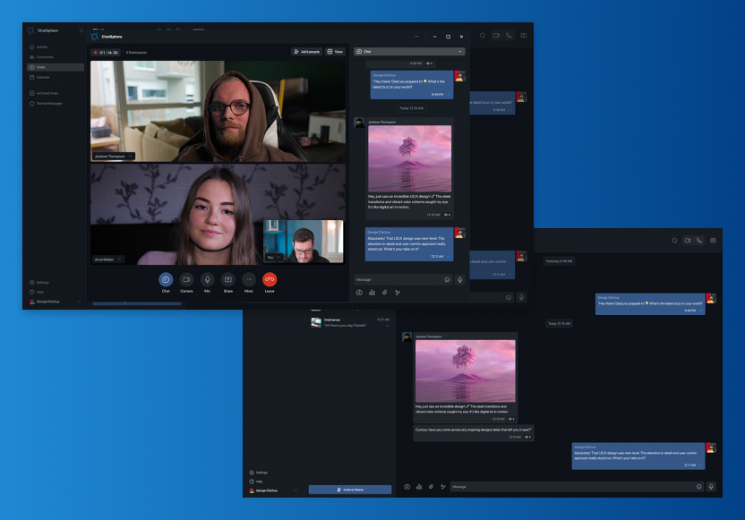

# ChatSphere

<figure>
    
    <figcaption>
    Layout by:
    <a href="https://dribbble.com/WesternJERO">George Chichua (Great person and great designer)</a>
    </figcaption>
</figure>


## Introduction
Chatsphere is a private project designed to leverage modern web technologies for building scalable and responsive chat applications. The project utilizes React, Styled Components, and Vite among other tools, offering a robust development environment with features like live reloading and efficient bundling.

## Table of Contents

- [ChatSphere](#chatsphere)
  - [Introduction](#introduction)
  - [Table of Contents](#table-of-contents)
  - [Installation](#installation)
  - [Usage](#usage)
  - [Features](#features)

## Installation
To get started with Chatsphere, clone the repository and install the dependencies:

```bash
gh repo clone rafaeldellaquila/chatsphere && cd chatsphere && bun i
```

> :memo: **Note:** Ensure you have Node.js installed on your system to use npm(OR bun OR deno OR whatever) for managing the dependencies.

## Usage
Here are some quick commands to run the project:

Development Server:
```bash
bun dev
```
> This command starts the development server using Vite.

Build Production:
```bash
bun build
```
> Compiles the TypeScript files and builds the production-ready static files.

Run Storybook:
```bash
bun sb
```
> Starts the Storybook environment for developing UI components in isolation.

Linting:
```bash
bun lint
```
> Lints the project files for any coding standard violations.

Generate:
```bash
bun generate {{ ComponentName }}
```
> Its a Component generator created with plop.js, this script create a folder with the components files inside with a boilerplate for tsx, styled and storybook.

This script will generate the folder inside the ``/components`` folder like this:
```md
└── ComponentName
    └── ComponentName.stories.tsx
    └── index.tsx
    └── styles.ts
```

You can see the templates inside the ``/generators`` folder in the root project.


## Features
- **React 18**: Utilizes the latest React version for efficient UI rendering.
- **Styled Components**: Allows writing CSS in JS with scoped styling for components.
- **i18next**: Internationalization support for building multi-lingual applications.
- **Storybook**: Integrated Storybook for component development and testing.


:warning: **Warning:** Work in Progress.